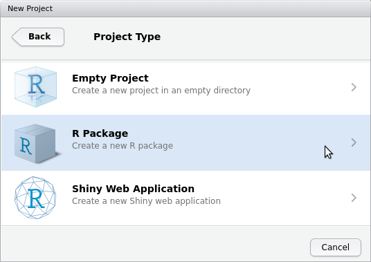
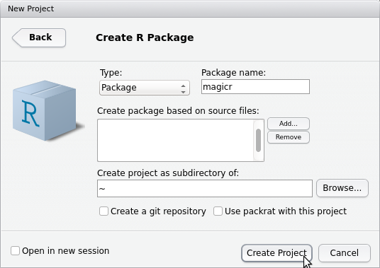
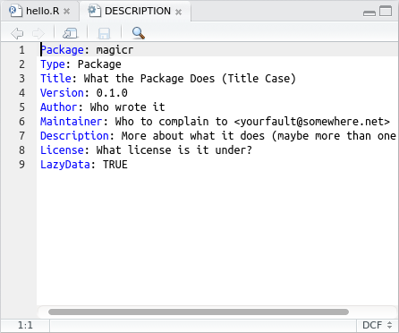
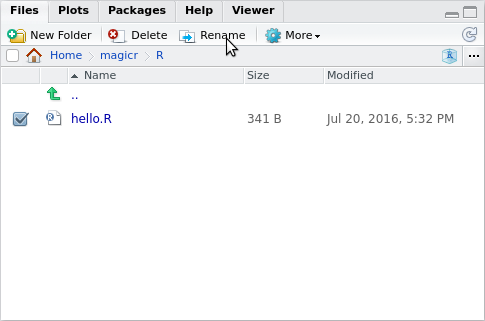
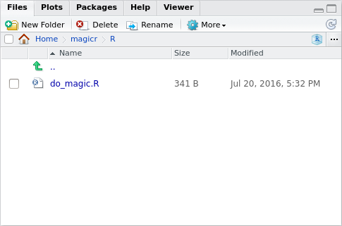

# Package development

# Create a new package

Start R Studio.


Choose `File | New Project`


Choose `New Directory`


Choose `R Package`



Name the package, e.g. `magicr` and click 'Create Project'



You just created your first package!

Here is how it looks like:


As you can see, there have been some folders and files created.
To file you are looking at now is called `hello.R` and is in 
the `R` (the naming is not very creative here) folder. You can
see that there is already put a function there, called `hello`.

Creating such default example code is great for beginners to 
get started. In this article, however, we will soon replace everything :sunglasses:.

Additional files created are:

 * a `.RBuildignore` file, that tells the package which files to ignore. A good example of an ignored file is `README.md`, which
   is the front page of your package its GitHub, but not used by the package itself
 * a `DESCRIPTION` file, that summarizes your package
 * a `NAMESPACE` file, that, among other, contains all your package its functions that are exported
 * a folder called `man`, with the file `man/hello.Rd`, that contains the manual/documation of your package.

In this article, we will:
 
 * Write the `DESCRIPTION` file
 * Write a function
 * Create a vignette
 * Create a test

## Write the `DESCRIPTION` file

The `DESCRIPTION` file summarizes your package. It contains the name, description, dependencies
and many more options.

The `DESCRIPTION` file has been default-created by RStudio and looks like this:



As you can see, the file contains hints how to create a working `DESCRIPTION` file.

To test our package now, we press CTRL-SHIFT-E or click 'Check' at the 'Build' tab at the top right:


Our default `DESCRIPTION` file will give errors, alongside helful suggestions to fix these.
I suggest to simply replace the code by this:

```
Package: magicr
Type: Package
Title: This Package Does Magic
Version: 0.1.0
Author: richel@richelbilderbeek.nl
Maintainer: Richel Bilderbeek <richel@richelbilderbeek.nl>
Description: This package does magic. Doing magic, in detail,
    is multiplying all values by two, except 42, which should remain 42.
    Doing magic includes checking if the input is a numeric.
License: GPL-3
LazyData: TRUE
RoxygenNote: 5.0.1
```

When we now press CTRL-SHIFT-E or click 'Check' at the 'Build' tab at the top right,
there will be no errors:


This is how we like it:

```
0 errors | 0 warnings | 0 notes
```

Before submitting your package to CRAN, it is a good
idea to have exactly zero errors, warnings and notes.

# Write a function 

In this example, we will write a function
that has an error, incorrect style and has incomplete
code coverage. 

Go to the correct file: click on the 'R' folder:


Click the filename `hello.R`:


Change the content to e.g. this:

```
#' Multiples all values by two, 
#'   except 42, which stays 42
#' @param x input, must be numeric
#' @return magicified output
#' @export
do_magic <- function(x)
{
  if (!is.numeric(x)) {
    stop("x must be numeric");
  }
  out = x * 2;
  out = replace(out, out == 84, 42);
  out;
}
```

Again, this function
has an error, incorrect style and has incomplete
code coverage.

Also, we will rename this file to `do_magic.R`:




If it states that the file `hello.R` has been moved or
renamed (and it has indeed), follow RStudio's suggestion
to close it.

And it worked:



When we now press CTRL-SHIFT-E or click 'Check' at the 'Build' tab at the top right,
there will be errors:


The errors state that:

 * `do_magic` lacks documentation
 * the documentation about `hello` cannot find the `hello` function

The errors are correct: we will have to add documentation now!

## Add documentation

For documentation, we will use the `roxygen2` package.

First, we will install the `roxygen2` package.

Click 'Tools | Install packages':

[](InstallPackage.png)

Then type `roxygen2`:


While `roxygen2` is installed, you'll see a lot of information in the Console window:


Here, I assume `roxygen2` gets installed without problems, as shown in the image. 

Now `roxygen2` is installed, our package must use it as a documentation engine.
To let this package use `roxygen2` for its documentation, click 'Project Options | Build Tools':


Click 'Use Roxygen'.

I like to let Roxygen rebuild everything at all times, but this is just personal:


Add the documentation like this:

```
#' Multiples all values by two, 
#'   except 42, which stays 42
#' @param x input, must be numeric
#' @return magicified output
#' @export
do_magic <- function(x)
{
  if (!is.numeric(x)) {
    stop("x must be numeric");
  }
  out = x * 2;
  out = replace(out, out == 84, 42);
  out;
}
```

Click 'Document' or `CTRL + SHIFT + D`:


You will see the first results:


It appears that `roxygen2` modifies your `DESCRIPTION` file, creates a file `do_magic.Rd` and
changes `NAMESPACE`. 

Click 'Clean and Rebuild'


The take a look at the documentation of `do_magic`,
by typing this in the console:

```
?do_magic
```

The help will be displayed at the bottom-right of the screen:


When we now press CTRL-SHIFT-E or click 'Check' at the 'Build' tab at the top right,
there will be errors:


This error is caused, because `hello` is documented, but does not exist anymore.

The non-existing function `hello` is located in the folder `man`. In the `Files` tab,
go to the `man` folder. You see the two documentation files: `do_magic.Rd` for the existing `do_magic` 
function, and `hello.Rd` for the absent `hello` function. Delete `hello.Rd` by checking
the checkbox left of `hello.Rd` and click `Delete`: 


When we now press CTRL-SHIFT-E or click 'Check' at the 'Build' tab at the top right,
there will be no errors!

# Write a vignette that describes and plots the function

With our `do_magic` function created and documented, it is time
to demonstrate it with a vignette.

Creating a vignette is easy: in the Console, type:

```
devtools::use_vignette("do_magic")
```
A default vignette will be created:


You can see that:

 * There is a folder created, called `vignettes`
 * There is a file created, called `do_magic.Rmd` (in the folder `vignettes`)
 * The folder name `inst/doc` is added to `.gitignore`, which means that `git` will ignore that folder 

In this article, we will ruthlessly convert it to:

[](VignetteAdapted.png)

(note that I cannot add the code in plaintext here).

Press 'Knit' or CTRL-SHIFT-K to 'knit' the document:


This will create a page like this:


# Add testthat to the package

Write 

```
devtools::use_test("do_magic")
```

# Test the package

You even wrote some tests, using 'testthat' (probably stored in 
a file calles *tests/testthat/test-do_magic.R*):

```
context("do_magic")

test_that("do_magic: use", {
  expect_equal(do_magic(42), 42)
  expect_equal(do_magic(1), 2)
})
```

# Conclusion

Well done! You've created your first package!

Next steps are:

 * Put it on GitHub, see 
 * Add Travis CI, see 'Professional R development: being a good boy/girl'
 

