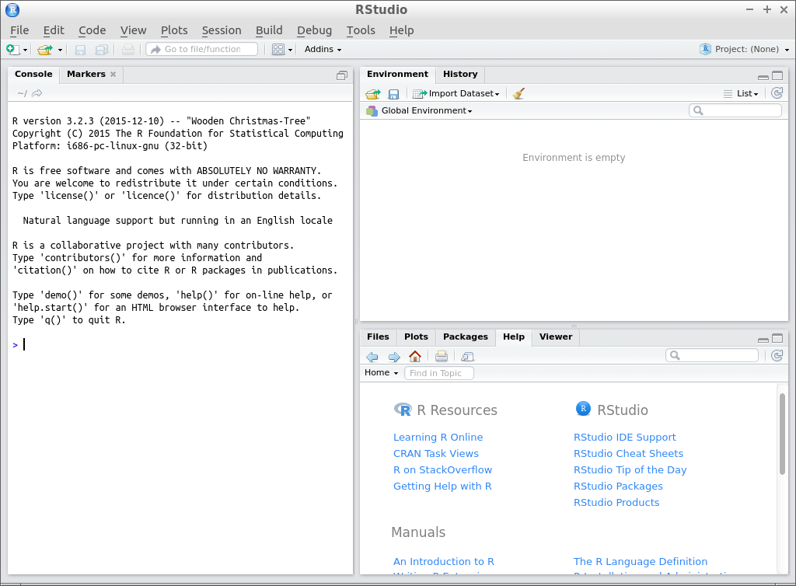
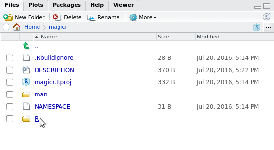
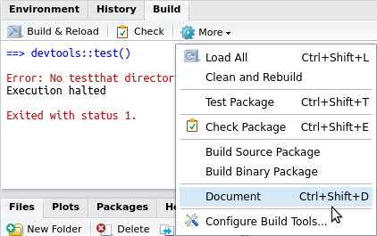
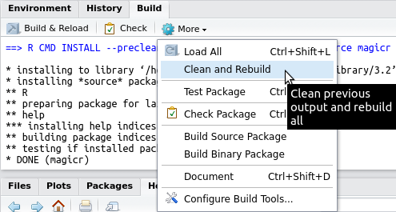

# Package development

# Create a new package

Start R Studio.



Choose `File | New Project`


Choose `New Directory`


Choose `R Package`


Name the package, e.g. `magicr` and click 'Create Project'


You just created your first package!

Here is how it looks like:


As you can see, there have been some folders and files created.
To file you are looking at now is called `hello.R` and is in 
the `R` (the naming is not very creative here) folder. You can
see that there is already put a function there, called `hello`.

Creating such default example code is great for beginners to 
get started. In this article, however, we will soon replace everything :sunglasses:.

Additional files created are:

 * a `.RBuildignore` file, that tells the package which files to ignore. A good example of an ignored file is `README.md`, which
   is the front page of your package its GitHub, but not used by the package itself
 * a `DESCRIPTION` file, that summarizes your package
 * a `NAMESPACE` file, that, among other, contains all your package its functions that are exported
 * a folder called `man`, with the file `man/hello.Rd`, that contains the manual/documation of your package.

In this article, we will:
 
 * Write the `DESCRIPTION` file
 * Write a function
 * Create a vignette
 * Create a test

## Write the `DESCRIPTION` file

The `DESCRIPTION` file summarizes your package. It contains the name, description, dependencies
and many more options.

The `DESCRIPTION` file has been default-created by RStudio and looks like this:


To test our package now, we press CTRL-SHIFT-E or click 'Check' at the 'Build' tab at the top right:


Our default `DESCRIPTION` file will give errors, alongside helful suggestions to fix these.
I suggest to simply replace the code by this:

```
Package: magicr
Type: Package
Title: This Package Does Magic
Version: 0.1.0
Author: richel@richelbilderbeek.nl
Maintainer: Richel Bilderbeek <richel@richelbilderbeek.nl>
Description: This package does magic. It calculates the density of the number
  42 in a vector. The number 314 counts as two 42's. It even checks
  if the input is valid!
License: GPL-3
LazyData: TRUE
```

When we now press CTRL-SHIFT-E or click 'Check' at the 'Build' tab at the top right,
there will be no errors:


This is how we like it:

```
0 errors | 0 warnings | 0 notes
```

Before submitting your package to CRAN, it is a good
idea to have exactly zero errors, warnings and notes.

# Write a function 

In this example, we will write a function
that has an error, incorrect style and has incomplete
code coverage.

Go to the correct file: click on the 'R' folder:



Click the filename `hello.R`:


Change the content to e.g. this:

```
do_magic <- function(x)
{
  if (length(x) == 0) {
    stop("do_magic: x must be of non-zero length")
  }
  sum = 0
  for (value in x) {
    if (x == 42) {
      sum = sum + 2
      next
    }
    if (x == 314) {
      sum = sum + 2
      next
    }
    if (x == 42) {
      sum = sum + 1
      next
    }
  }
  out = sum / length(x)
  out
}
```

Again, this function
has an error, incorrect style and has incomplete
code coverage.

Also, we will rename this file to `do_magic.R`:


If it states that the file `hello.R` has been moved or
renamed (and it has indeed), follow RStudio's suggestion
to close it.

And it worked:


When we now press CTRL-SHIFT-E or click 'Check' at the 'Build' tab at the top right,
there will be errors:


The errors state that:

 * `do_magic` lacks documentation
 * the documentation about `hello` cannot find the `hello` function

The errors are correct: we will have to add documentation now!

## Add documentation

For documentation, we will use the `roxygen2` package.

First, we will install the `roxygen2` package.

Click 'Tools | Install packages':

[](InstallPackage.png)

Then type `roxygen2`:


While `roxygen2` is installed, you'll see a lot of information in the Console window:


Here, I assume `roxygen2` gets installed without problems, as shown in the image. 

Now `roxygen2` is installed, our package must use it as a documentation engine.
To let this package use `roxygen2` for its documentation, click 'Project Options | Build Tools':


Click 'Use Roxygen'.

I like to let Roxygen rebuild everything at all times, but this is just personal:


Add the documentation like this:

```
#' Does magic
#' @param x The vector to work on
#' @return the density of 42's in x, where 314 counts as two 42's.
#' @export
do_magic <- function(x)
{
  if (length(x) == 0) {
    stop("do_magic: x must be of non-zero length")
  }
  sum = 0
  for (value in x) {
    if (x == 42) {
      sum = sum + 42
      next
    }
    if (x == 314) {
      sum = sum + 2
      next
    }
    if (x == 42) {
      sum = sum + 1
      next
    }
  }
  out = sum / length(x)
  out
}
```

Click 'Document (CTRL + SHIFT + D)'



Click 'Clean and Rebuild'



The take a look at the documentation of `do_magic`,
by typing this in the console:

```
?do_magic
```

# Write a vignette that describes and plots the function

```
devtools::use_vignette("do_magic")
```


# Test the package

Write 

```
devtools::use_test("do_magic")
```

 * Test the package
 * Write a test
 * Make the code crash on the bug
 * Fix the bug
 