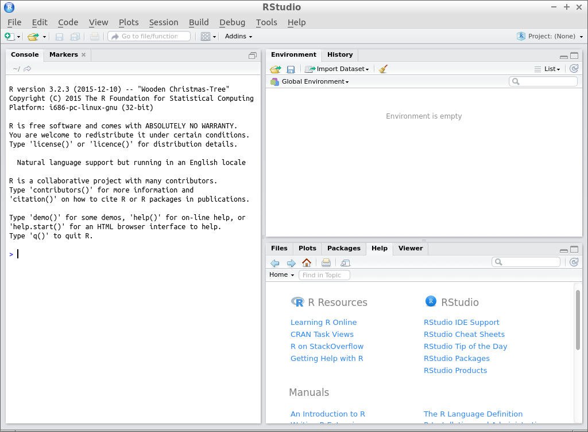

# Package development

# Create a new package

Start R Studio.



Choose `File | New Project`


Choose `New Directory`


Choose `R Package`


Name the package, e.g. `magicr` and click 'Create Project'


You just created your first package:


## Write the DESCRIPTION file

The `DESCRIPTION` file needs to be fixed:


Change it to:

```
Package: magicr
Type: Package
Title: This Package Does Magic
Version: 0.1.0
Author: richel@richelbilderbeek.nl
Maintainer: Richel Bilderbeek <richel@richelbilderbeek.nl>
Description: This package does magic. It calculates the density of the number
  42 in a vector. The number 314 counts as two 42's. It even checks
  if the input is valid!
License: GPL-3
LazyData: TRUE
```

# Write a function 

In this example, we will write a function
that has an error, incorrect style and has incomplete
code coverage.

Go to the correct file: click on the 'R' folder:


Click the filename 'hello.R':


Change the content to e.g. this:

```
do_magic <- function(x)
{
  if (length(x) == 0) {
    stop("do_magic: x must be of non-zero length")
  }
  sum = 0
  for (value in x) {
    if (x == 42) {
      sum = sum + 2
      next
    }
    if (x == 314) {
      sum = sum + 2
      next
    }
    if (x == 42) {
      sum = sum + 1
      next
    }
  }
  out = sum / length(x)
  out
}
```

Again, this function
has an error, incorrect style and has incomplete
code coverage.

Also, we will rename this file to `do_magic.R`:


If it states that the file `hello.R` has been moved or
renamed (and it has indeed), follow RStudio's suggestion
to close it.

And it worked:


## Add documentation

Click 'Project Options | Build Tools':


Click 'Use Roxygen'.

I like to let Roxygen rebuild everything at all times, but this is just personal:


Add the documentation like this:

```
#' Does magic
#' @param x The vector to work on
#' @return the density of 42's in x, where 314 counts as two 42's.
#' @export
do_magic <- function(x)
{
  if (length(x) == 0) {
    stop("do_magic: x must be of non-zero length")
  }
  sum = 0
  for (value in x) {
    if (x == 42) {
      sum = sum + 42
      next
    }
    if (x == 314) {
      sum = sum + 2
      next
    }
    if (x == 42) {
      sum = sum + 1
      next
    }
  }
  out = sum / length(x)
  out
}
```

Click 'Document (CTRL + SHIFT + D)'


Click 'Clean and Rebuild'


The take a look at the documentation of `do_magic`,
by typing this in the console:

```
?do_magic
```

# Write a vignette that describes and plots the function

```
devtools::use_vignette("do_magic")
```


# Test the package

Write 

```
devtools::use_test("do_magic")
```

 * Test the package
 * Write a test
 * Make the code crash on the bug
 * Fix the bug
 