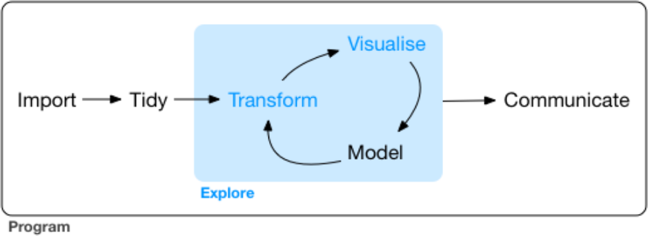

ggplot2
========================================================
author: Richel Bilderbeek
date: 2018-05-09
autosize: true


[https://github.com/richelbilderbeek/Science](https://github.com/richelbilderbeek/Science)  


Desire
========================================================
title: false


Non-goal
========================================================


<!-- I will give many examples to demonstrate ggplot2 -->
<!-- One can use any search engine to do that -->

Goal
========================================================

***
- Why use `ggplot2`
- Philosophy behind `ggplot2`
- Incorrect use of `ggplot2`
- Correct use of `ggplot2`


```r
library(ggplot2)
```

<!-- This talk is about what one cannot find on Stack Overflow -->
<!-- and prevents needing to go there -->

Why use ggplot2?
========================================================

 * A grammar of graphics to express oneself in
 * Forced to work tidily
 * Recommended for teaching

***


Philosophy
========================================================

***


<!-- 'Grammar of Graphics' came out in 2005 -->

Philosophy
========================================================


<!-- 'Grammar of Graphics' has an idea behind it -->

Philosophy
========================================================

***
 * Grammar of Graphics
 * Tidy Data


*Wickham & Grolemund. R for data science. 2016*

<!-- Wickham: most time is spent tidying data -->

Frequency data
========================================================


Messy data
========================================================


```r
messy_df <- data.frame(
  matrix(rnorm(n = 1000), ncol = 1000)
)
colnames(messy_df) <- paste0(
  "z", seq(1, 1000)
)
knitr::kable(messy_df[, 1:6])
```


|        z1|        z2|        z3|         z4|        z5|        z6|
|---------:|---------:|---------:|----------:|---------:|---------:|
| 0.6539183| 0.0190523| -1.849504| -0.1327633| -1.198818| -1.329741|

Plotting messy data is easy without ggplot2
========================================================


```r
hist(t(messy_df))
```


Plotting messy data is hard in ggplot2
========================================================


```r
ggplot(
  data.frame(z = t(messy_df[1, ])[, 1]),
  aes(z)
) + geom_histogram()
```


<!-- if data is messy, a ggplot2 call will look ugly  -->

Tidy Data
========================================================

***
 * One measurement per row, 'long form'
 * Factors as factors


```r
library(tidyr)
```


Wrangling messy data to Tidy Data
========================================================


```r
df <- gather(messy_df, "replicate", "value")
knitr::kable(df[1:6, ])
```


|replicate |      value|
|:---------|----------:|
|z1        |  0.6539183|
|z2        |  0.0190523|
|z3        | -1.8495040|
|z4        | -0.1327633|
|z5        | -1.1988182|
|z6        | -1.3297415|

Plotting Tidy Data is easy
========================================================


```r
ggplot(df, aes(value)) +
  geom_histogram()
```


Plotting Tidy Data is easy
========================================================


```r
ggplot(df, aes(value)) +
  geom_density()
```


Plotting Tidy Data is easy
========================================================


```r
ggplot(df, aes(x = "", y = value)) +
  geom_boxplot()
```


Plotting Tidy Data is easy
========================================================


```r
ggplot(df, aes(x = "", y = value)) +
  geom_violin()
```


Messy data
========================================================


```r
messy_df <- data.frame(
  matrix(
    rnorm(n = 2002), ncol = 1001, nrow = 2
  )
)
colnames(messy_df) <- c(
  "treatment", paste0("z", seq(1, 1000))
)
messy_df[1, 1] <- "A"
messy_df[2, 1] <- "B"
knitr::kable(messy_df[, 1:6])
```


|treatment |         z1|        z2|         z3|        z4|         z5|
|:---------|----------:|---------:|----------:|---------:|----------:|
|A         | -0.1836515| 1.9340660| -0.8871935| 0.2657320|  0.1569296|
|B         |  0.0887142| 0.0827711|  0.5865041| 0.6194539| -1.0828811|

Plotting messy data is easy without ggplot2
========================================================


```r
hist(as.numeric(messy_df[1, 2:1001]))
hist(
  as.numeric(messy_df[2, 2:1001]), 
  add = TRUE
)
```


<!-- Note: the reason I do not use a stacked histogram, -->
<!-- is because there is no easy way without ggplot2 -->

Plotting messy data is hard in ggplot2
========================================================


```r
ggplot(
  data.frame(
    treatment = rep(
      messy_df$treatment, each = 1000
    ),
    z = c(
      t(messy_df[1, 2:1001])[, 1], 
      t(messy_df[2, 2:1001])[, 1]
    )
  ),
  aes(z, fill = treatment)
) + geom_histogram(position = "identity")
```


<!-- if data is messy, a ggplot2 call will look ugly  -->

Wrangling messy data to Tidy Data
========================================================


```r
df <- gather(
  messy_df, "replicate", "value", z1:z1000
)
knitr::kable(df[1:6, ])
```


|treatment |replicate |      value|
|:---------|:---------|----------:|
|A         |z1        | -0.1836515|
|B         |z1        |  0.0887142|
|A         |z2        |  1.9340660|
|B         |z2        |  0.0827711|
|A         |z3        | -0.8871935|
|B         |z3        |  0.5865041|

Plotting Tidy Data is easy
========================================================


```r
ggplot(
  df, aes(x = value, fill = treatment)
) + geom_histogram(position = "identity")
```


Plotting Tidy Data is easy
========================================================


```r
ggplot(
  df, aes(x = value, fill = treatment)
) + geom_density()
```


Plotting Tidy Data is easy
========================================================


```r
ggplot(
  df, aes(x = treatment, y = value)
) + geom_boxplot()
```


Plotting Tidy Data is easy
========================================================


```r
ggplot(
  df, aes(x = treatment, y = value)
) + geom_violin()
```


Messy data
========================================================


```r
messy_df <- data.frame(
  treatment = rep(c(1, 2), times = 1000),
  value = rnorm(n = 2000)
)
knitr::kable(head(messy_df))
```


| treatment|      value|
|---------:|----------:|
|         1| -1.7130498|
|         2|  0.8466842|
|         1|  1.1075262|
|         2|  0.2018014|
|         1| -0.1251446|
|         2| -0.2059191|

<!-- messy data: treatment is not a factor  -->

Plotting messy data is easy without ggplot2
========================================================


```r
hist(messy_df[messy_df$treatment == 1, 2])
hist(
  messy_df[messy_df$treatment == 2, 2], 
  add = TRUE
)
```


Plotting messy data goes wrong in ggplot2
========================================================


```r
ggplot(
  messy_df, 
  aes(x = value, fill = treatment)
) + geom_histogram(position = "identity")
```


<!-- Does not seperate by treatment, would confuse a beginner -->

Plotting messy data is hard in ggplot2
========================================================


```r
ggplot(position = "identity") + 
  geom_histogram(
    data = messy_df[
      messy_df$treatment == 1, 
    ], 
    aes(value), fill = "red"
  ) + 
  geom_histogram(
    data = messy_df[
      messy_df$treatment == 2, 
    ], 
    aes(value), fill = "blue"
  )
```


<!-- if data is messy, a ggplot2 call will look ugly  -->

Wrangling messy data to Tidy Data
========================================================


```r
df <- messy_df
df$treatment <- as.factor(df$treatment)
knitr::kable(df[1:6, ])
```


|treatment |      value|
|:---------|----------:|
|1         | -1.7130498|
|2         |  0.8466842|
|1         |  1.1075262|
|2         |  0.2018014|
|1         | -0.1251446|
|2         | -0.2059191|

Plotting Tidy Data is easy
========================================================


```r
ggplot(
  df, 
  aes(x = value, fill = treatment)
) + geom_histogram(position = "identity")
```


Plotting Tidy Data is easy
========================================================


```r
ggplot(
  df, 
  aes(x = value, fill = treatment)
) + geom_density()
```


Plotting Tidy Data is easy
========================================================


```r
ggplot(
  df, 
  aes(x = treatment, y = value)
) + geom_boxplot()
```


Plotting Tidy Data is easy
========================================================


```r
ggplot(
  df, 
  aes(x = treatment, y = value)
) + geom_violin()
```


Conclusions
========================================================

 * It is hard to plot messy data in `ggplot2`
 * It is easy to plot Tidy Data in `ggplot2`
 * Use Tidy Data, don't forget factors

Questions?
========================================================


[https://github.com/richelbilderbeek/Science](https://github.com/richelbilderbeek/Science)  


